```mermaid
flowchart TB
    subgraph current["GizboxAOT.csproj"]
        MAIN["<b>📦&nbsp;GizboxAOT.csproj</b><br/><small>netstandard2.0</small>"]
        click MAIN "#f:legacymyprojectsgizboxgizboxaotgizboxaotcsproj"
    end
    subgraph downstream["Dependencies (1"]
        P1["<b>📦&nbsp;Gizbox.csproj</b><br/><small>netstandard2.0</small>"]
        click P1 "#gizboxcsproj"
    end
    MAIN --> P1

```

```mermaid
flowchart TB
    subgraph current["GizboxLSP.csproj"]
        MAIN["<b>📦&nbsp;GizboxLSP.csproj</b><br/><small>net8.0</small>"]
        click MAIN "#f:legacymyprojectsgizboxgizboxlspgizboxlspcsproj"
    end
    subgraph downstream["Dependencies (1"]
        P1["<b>📦&nbsp;Gizbox.csproj</b><br/><small>netstandard2.0</small>"]
        click P1 "#gizboxcsproj"
    end
    MAIN --> P1

```

```mermaid
flowchart TB
    subgraph current["GizboxTest.csproj"]
        MAIN["<b>📦&nbsp;GizboxTest.csproj</b><br/><small>net8.0</small>"]
        click MAIN "#f:legacymyprojectsgizboxgizboxtestgizboxtestcsproj"
    end
    subgraph downstream["Dependencies (1"]
        P1["<b>📦&nbsp;Gizbox.csproj</b><br/><small>netstandard2.0</small>"]
        click P1 "#gizboxcsproj"
    end
    MAIN --> P1

```

```mermaid
flowchart TB
    subgraph upstream["Dependants (3)"]
        P2["<b>📦&nbsp;GizboxTest.csproj</b><br/><small>net8.0</small>"]
        P3["<b>📦&nbsp;GizboxAOT.csproj</b><br/><small>netstandard2.0</small>"]
        P4["<b>📦&nbsp;GizboxLSP.csproj</b><br/><small>net8.0</small>"]
        click P2 "#f:legacymyprojectsgizboxgizboxtestgizboxtestcsproj"
        click P3 "#f:legacymyprojectsgizboxgizboxaotgizboxaotcsproj"
        click P4 "#f:legacymyprojectsgizboxgizboxlspgizboxlspcsproj"
    end
    subgraph current["Gizbox.csproj"]
        MAIN["<b>📦&nbsp;Gizbox.csproj</b><br/><small>netstandard2.0</small>"]
        click MAIN "#gizboxcsproj"
    end
    P2 --> MAIN
    P3 --> MAIN
    P4 --> MAIN

```

# Projects and dependencies analysis

This document provides a comprehensive overview of the projects and their dependencies in the context of upgrading to .NETCoreApp,Version=v10.0.

## Table of Contents

- [Executive Summary](#executive-Summary)
  - [Highlevel Metrics](#highlevel-metrics)
  - [Projects Compatibility](#projects-compatibility)
  - [Package Compatibility](#package-compatibility)
  - [API Compatibility](#api-compatibility)
- [Aggregate NuGet packages details](#aggregate-nuget-packages-details)
- [Top API Migration Challenges](#top-api-migration-challenges)
  - [Technologies and Features](#technologies-and-features)
  - [Most Frequent API Issues](#most-frequent-api-issues)
- [Projects Relationship Graph](#projects-relationship-graph)
- [Project Details](#project-details)

  - [F:\Legacy\MyProjects\Gizbox\GizboxAOT\GizboxAOT.csproj](#f:legacymyprojectsgizboxgizboxaotgizboxaotcsproj)
  - [F:\Legacy\MyProjects\Gizbox\GizboxLSP\GizboxLSP.csproj](#f:legacymyprojectsgizboxgizboxlspgizboxlspcsproj)
  - [F:\Legacy\MyProjects\Gizbox\GizboxTest\GizboxTest.csproj](#f:legacymyprojectsgizboxgizboxtestgizboxtestcsproj)
  - [Gizbox.csproj](#gizboxcsproj)

## Executive Summary

### Highlevel Metrics

| Metric | Count | Status |
| :--- | :---: | :--- |
| Total Projects | 4 | 2 require upgrade |
| Total NuGet Packages | 3 | 1 need upgrade |
| Total Code Files | 39 |  |
| Total Code Files with Incidents | 3 |  |
| Total Lines of Code | 35601 |  |
| Total Number of Issues | 6 |  |
| Estimated LOC to modify | 3+ | at least 0.0% of codebase |

### Projects Compatibility

| Project | Target Framework | Difficulty | Package Issues | API Issues | Est. LOC Impact | Description |
| :--- | :---: | :---: | :---: | :---: | :---: | :--- |
| [F:\Legacy\MyProjects\Gizbox\GizboxAOT\GizboxAOT.csproj](#f:legacymyprojectsgizboxgizboxaotgizboxaotcsproj) | netstandard2.0 | ✅ None | 0 | 0 |  | ClassLibrary, Sdk Style = True |
| [F:\Legacy\MyProjects\Gizbox\GizboxLSP\GizboxLSP.csproj](#f:legacymyprojectsgizboxgizboxlspgizboxlspcsproj) | net8.0 | 🟢 Low | 1 | 3 | 3+ | DotNetCoreApp, Sdk Style = True |
| [F:\Legacy\MyProjects\Gizbox\GizboxTest\GizboxTest.csproj](#f:legacymyprojectsgizboxgizboxtestgizboxtestcsproj) | net8.0 | 🟢 Low | 0 | 0 |  | DotNetCoreApp, Sdk Style = True |
| [Gizbox.csproj](#gizboxcsproj) | netstandard2.0 | ✅ None | 0 | 0 |  | ClassLibrary, Sdk Style = True |

### Package Compatibility

| Status | Count | Percentage |
| :--- | :---: | :---: |
| ✅ Compatible | 2 | 66.7% |
| ⚠️ Incompatible | 0 | 0.0% |
| 🔄 Upgrade Recommended | 1 | 33.3% |
| ***Total NuGet Packages*** | ***3*** | ***100%*** |

### API Compatibility

| Category | Count | Impact |
| :--- | :---: | :--- |
| 🔴 Binary Incompatible | 0 | High - Require code changes |
| 🟡 Source Incompatible | 1 | Medium - Needs re-compilation and potential conflicting API error fixing |
| 🔵 Behavioral change | 2 | Low - Behavioral changes that may require testing at runtime |
| ✅ Compatible | 27050 |  |
| ***Total APIs Analyzed*** | ***27053*** |  |

## Aggregate NuGet packages details

| Package | Current Version | Suggested Version | Projects | Description |
| :--- | :---: | :---: | :--- | :--- |
| LLVMSharp | 16.0.0 |  | [GizboxAOT.csproj](#f:legacymyprojectsgizboxgizboxaotgizboxaotcsproj) | ✅Compatible |
| NETStandard.Library | 2.0.3 |  | [Gizbox.csproj](#gizboxcsproj) [GizboxAOT.csproj](#f:legacymyprojectsgizboxgizboxaotgizboxaotcsproj) | ✅Compatible |
| Newtonsoft.Json | 13.0.3 | 13.0.4 | [GizboxLSP.csproj](#f:legacymyprojectsgizboxgizboxlspgizboxlspcsproj) | 建议升级 NuGet 包 |

## Top API Migration Challenges

### Technologies and Features

| Technology | Issues | Percentage | Migration Path |
| :--- | :---: | :---: | :--- |

### Most Frequent API Issues

| API | Count | Percentage | Category |
| :--- | :---: | :---: | :--- |
| T:System.Uri | 1 | 33.3% | Behavioral Change |
| M:System.Uri.#ctor(System.String) | 1 | 33.3% | Behavioral Change |
| M:System.TimeSpan.FromSeconds(System.Double) | 1 | 33.3% | Source Incompatible |

## Projects Relationship Graph

Legend:
📦 SDK-style project
⚙️ Classic project

```mermaid
flowchart LR
    P1["<b>📦&nbsp;Gizbox.csproj</b><br/><small>netstandard2.0</small>"]
    P2["<b>📦&nbsp;GizboxTest.csproj</b><br/><small>net8.0</small>"]
    P3["<b>📦&nbsp;GizboxAOT.csproj</b><br/><small>netstandard2.0</small>"]
    P4["<b>📦&nbsp;GizboxLSP.csproj</b><br/><small>net8.0</small>"]
    P2 --> P1
    P3 --> P1
    P4 --> P1
    click P1 "#gizboxcsproj"
    click P2 "#f:legacymyprojectsgizboxgizboxtestgizboxtestcsproj"
    click P3 "#f:legacymyprojectsgizboxgizboxaotgizboxaotcsproj"
    click P4 "#f:legacymyprojectsgizboxgizboxlspgizboxlspcsproj"

```

## Project Details

### F:\Legacy\MyProjects\Gizbox\GizboxAOT\GizboxAOT.csproj

#### Project Info

- **Current Target Framework:** netstandard2.0✅
- **SDK-style**: True
- **Project Kind:** ClassLibrary
- **Dependencies**: 1
- **Dependants**: 0
- **Number of Files**: 1
- **Lines of Code**: 209
- **Estimated LOC to modify**: 0+ (at least 0.0% of the project)

#### Dependency Graph

Legend:
📦 SDK-style project
⚙️ Classic project

### API Compatibility

| Category | Count | Impact |
| :--- | :---: | :--- |
| 🔴 Binary Incompatible | 0 | High - Require code changes |
| 🟡 Source Incompatible | 0 | Medium - Needs re-compilation and potential conflicting API error fixing |
| 🔵 Behavioral change | 0 | Low - Behavioral changes that may require testing at runtime |
| ✅ Compatible | 0 |  |
| ***Total APIs Analyzed*** | ***0*** |  |

#### Project Package References

| Package | Type | Current Version | Suggested Version | Description |
| :--- | :---: | :---: | :---: | :--- |
| LLVMSharp | Explicit | 16.0.0 |  | ✅Compatible |
| NETStandard.Library | 🔗*Transitive* | 2.0.3 |  | ✅Compatible |

### F:\Legacy\MyProjects\Gizbox\GizboxLSP\GizboxLSP.csproj

#### Project Info

- **Current Target Framework:** net8.0
- **Proposed Target Framework:** net10.0
- **SDK-style**: True
- **Project Kind:** DotNetCoreApp
- **Dependencies**: 1
- **Dependants**: 0
- **Number of Files**: 1
- **Number of Files with Incidents**: 2
- **Lines of Code**: 727
- **Estimated LOC to modify**: 3+ (at least 0.4% of the project)

#### Dependency Graph

Legend:
📦 SDK-style project
⚙️ Classic project

### API Compatibility

| Category | Count | Impact |
| :--- | :---: | :--- |
| 🔴 Binary Incompatible | 0 | High - Require code changes |
| 🟡 Source Incompatible | 1 | Medium - Needs re-compilation and potential conflicting API error fixing |
| 🔵 Behavioral change | 2 | Low - Behavioral changes that may require testing at runtime |
| ✅ Compatible | 592 |  |
| ***Total APIs Analyzed*** | ***595*** |  |

#### Project Package References

| Package | Type | Current Version | Suggested Version | Description |
| :--- | :---: | :---: | :---: | :--- |
| Newtonsoft.Json | Explicit | 13.0.3 | 13.0.4 | 建议升级 NuGet 包 |

### F:\Legacy\MyProjects\Gizbox\GizboxTest\GizboxTest.csproj

#### Project Info

- **Current Target Framework:** net8.0
- **Proposed Target Framework:** net10.0
- **SDK-style**: True
- **Project Kind:** DotNetCoreApp
- **Dependencies**: 1
- **Dependants**: 0
- **Number of Files**: 1
- **Number of Files with Incidents**: 1
- **Lines of Code**: 273
- **Estimated LOC to modify**: 0+ (at least 0.0% of the project)

#### Dependency Graph

Legend:
📦 SDK-style project
⚙️ Classic project

### API Compatibility

| Category | Count | Impact |
| :--- | :---: | :--- |
| 🔴 Binary Incompatible | 0 | High - Require code changes |
| 🟡 Source Incompatible | 0 | Medium - Needs re-compilation and potential conflicting API error fixing |
| 🔵 Behavioral change | 0 | Low - Behavioral changes that may require testing at runtime |
| ✅ Compatible | 291 |  |
| ***Total APIs Analyzed*** | ***291*** |  |

#### Project Package References

| Package | Type | Current Version | Suggested Version | Description |
| :--- | :---: | :---: | :---: | :--- |

### Gizbox.csproj

#### Project Info

- **Current Target Framework:** netstandard2.0✅
- **SDK-style**: True
- **Project Kind:** ClassLibrary
- **Dependencies**: 0
- **Dependants**: 3
- **Number of Files**: 36
- **Lines of Code**: 34392
- **Estimated LOC to modify**: 0+ (at least 0.0% of the project)

#### Dependency Graph

Legend:
📦 SDK-style project
⚙️ Classic project

### API Compatibility

| Category | Count | Impact |
| :--- | :---: | :--- |
| 🔴 Binary Incompatible | 0 | High - Require code changes |
| 🟡 Source Incompatible | 0 | Medium - Needs re-compilation and potential conflicting API error fixing |
| 🔵 Behavioral change | 0 | Low - Behavioral changes that may require testing at runtime |
| ✅ Compatible | 26167 |  |
| ***Total APIs Analyzed*** | ***26167*** |  |

